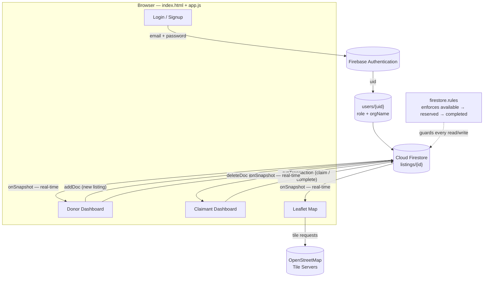

# ResQShare

**Real-time surplus food rescue — connecting restaurants and bakeries (Donors) with shelters and charities (Claimants) before the pickup window closes.**

Built as a BSCS capstone / scholarship portfolio project. No build step — plain HTML5, Tailwind CSS, and vanilla ES6+ JavaScript, backed by Firebase for auth and real-time data, and Leaflet/OpenStreetMap for zero-cost geographic tracking.

#Website
resqshare.vercel.app

---

## The problem

Restaurants and bakeries throw away edible surplus food every day, while nearby shelters go without. The gap isn't a lack of food — it's a lack of a fast, low-friction channel to connect the two before the food (or the pickup window) expires. ResQShare is that channel: a donor can post a listing in under two minutes, and a claimant sees it appear on their map instantly, with a live countdown to the pickup deadline.

## Features

- **Dual-portal interface** — a single account is either a Donor or a Claimant, each with a dedicated dashboard.
- **Live inventory pipeline** — every dashboard, map, and metric is driven by one real-time Firestore listener (`onSnapshot`), so a new listing or a claim appears everywhere within milliseconds, with no page refresh.
- **Claim-safe transactions** — claiming and completing a pickup both run inside a Firestore `runTransaction`, so two shelters racing for the same listing can't both win.
- **Interactive geolocation map** — Leaflet + OpenStreetMap markers, color-coded by status (green = available, gold = reserved), with popups for details and one-tap claiming.
- **Address-to-map geocoding** — a donor types a pickup address and a pin drops automatically (via Nominatim/OpenStreetMap, no API key), with the marker still draggable afterward to fine-tune the exact spot.
- **Freshness ring** — every listing card shows a depleting countdown ring (green → gold → red) tracking time left in the pickup window, so urgency is visible at a glance, not just labeled.
- **Live impact metrics** — Meals Rescued, Shelters Served, and Waste Diverted are computed from real completed listings, layered on a documented network baseline.

## Tech stack

| Layer | Choice |
|---|---|
| Frontend | HTML5, Tailwind CSS (CDN), vanilla JavaScript (ES6+ modules) |
| Auth & database | Firebase Authentication (Email/Password) + Cloud Firestore, Web SDK v9+ |
| Maps | Leaflet.js + OpenStreetMap tiles (no API key, no cost) |
| Hosting | Vercel (static deploy, no build step) |

## Architecture



**Data flow in one sentence:** a Donor's `addDoc` and a Claimant's `runTransaction` are the only ways data changes; every screen — including the map — just re-renders from the same live `onSnapshot` stream, so there is exactly one source of truth.

## Data model

**`users/{uid}`**
```json
{
  "uid": "string",
  "email": "string",
  "role": "donor | claimant",
  "orgName": "string",
  "createdAt": "timestamp"
}
```

**`listings/{listingId}`**
```json
{
  "donorId": "string",
  "donorName": "string",
  "foodName": "string",
  "description": "string",
  "servings": "number",
  "weightLb": "number",
  "address": "string",
  "lat": "number",
  "lng": "number",
  "pickupWindowStart": "timestamp",
  "pickupWindowEnd": "timestamp",
  "expiresAt": "timestamp",
  "postedAt": "timestamp",
  "status": "available | reserved | completed",
  "claimedBy": "string | null",
  "claimedByName": "string | null",
  "claimedAt": "timestamp | null",
  "completedAt": "timestamp | null"
}
```

Full field-by-field notes live in [`firestore-schema.json`](./firestore-schema.json).

## Security model

Access control is enforced server-side in [`firestore.rules`](./firestore.rules), not just in the UI:

- Any signed-in user can **read** listings (both roles need this — claimants to browse, donors to see their own).
- Only a signed-in **donor** can **create** a listing, and only as themselves.
- **available → reserved**: any signed-in claimant, atomically, via a transaction.
- **reserved → completed**: only the claimant who reserved it.
- **available → deleted**: only the owning donor, and only while still unclaimed.

> Production note: a scheduled Cloud Function would be the right place to auto-expire stale `available` listings once their pickup window passes, since Firestore rules can't run on a timer by themselves — out of scope for this MVP.

## Project structure

```
ResQShare/
├── index.html            # Full layout: auth screen, both dashboards, both maps
├── app.js                # All application logic (auth, real-time sync, transactions, maps)
├── firebase-config.js    # Firebase Auth + Firestore initialization
├── firestore.rules       # Security rules (state machine enforcement)
├── firestore-schema.json # Document schema reference
└── README.md             # This file
```

## Getting started

1. Create a project at [console.firebase.google.com](https://console.firebase.google.com).
2. **Build → Authentication → Sign-in method** → enable **Email/Password**.
3. **Build → Firestore Database** → create a database (production mode) → **Rules** tab → paste in `firestore.rules` → **Publish**.
4. **Project settings → General → Your apps** → register a **Web app** → copy the `firebaseConfig` values into `firebase-config.js`.
5. Serve locally (ES modules require `http://`, not `file://`):
   ```bash
   npx serve .
   ```
6. Deploy for free on [Vercel](https://vercel.com) — no build step, just upload the folder. Then add your live domain to **Authentication → Settings → Authorized domains** in Firebase, or login will silently fail on the live site.

## Roadmap / future work

- Photo uploads on listings (Firebase Cloud Storage)
- Scheduled Cloud Function to auto-expire stale listings
- SMS/email notifications when a nearby listing is posted
- Donor-side analytics (which items get claimed fastest)

## License

MIT — free to use for educational and portfolio purposes.
